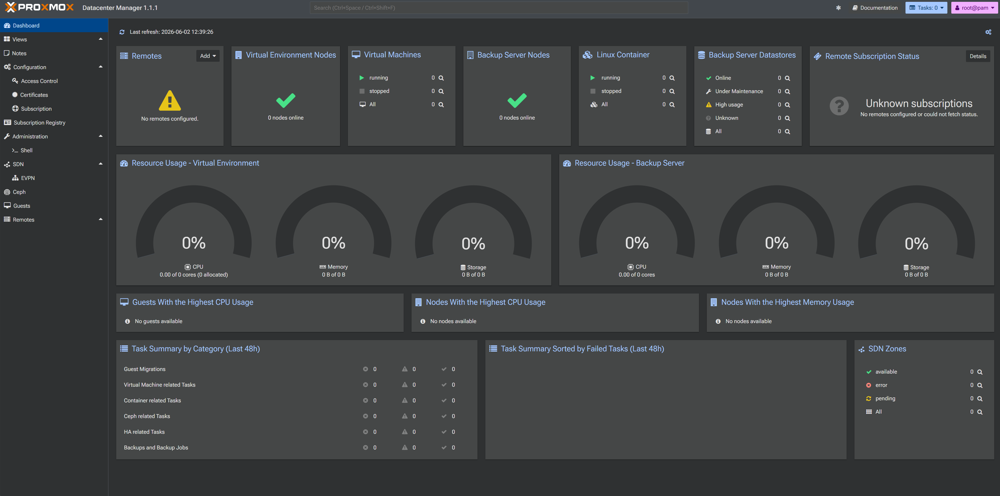
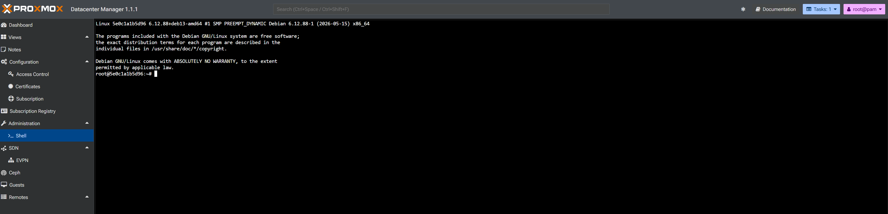

## Dockerized Proxmox Datacenter Manager

## Table of contents
- [Overview](#overview)
- [Getting Started](#getting-started)
- [License](#license)
- [Troubleshooting](#troubleshooting)

## Overview
This projects ports Proxmox Datacenter Manager under Docker




> [!NOTE]
> Default username and password:
>
>**Username**: root 
>
>**Password**: pdm
>


> [!IMPORTANT]
> Change the default password after running the container with a strong password and implement 2FA!
> 
> If exposed to the public internet with default credentials, the container **can** be compromised!

## Getting Started
To run this container there are 2 ways:
- Automatic script:
```bash
curl -fsSL https://git.vichingo455.com/Vichingo455/pdm-docker/raw/branch/main/setup.sh | bash
```
- Manually:
```bash
wget https://git.vichingo455.com/Vichingo455/pdm-docker/raw/branch/main/src/docker-compose.yml
docker compose up -d
```

## License
This project is provided as-is for the Proxmox community. Proxmox Datacenter Manager is a product of [Proxmox Server Solutions GmbH](https://www.proxmox.com/). I don't have any rights on this.

## Troubleshooting
Make an issue and I'll try my best to help (I'm not a Linux/Docker/Proxmox guru).